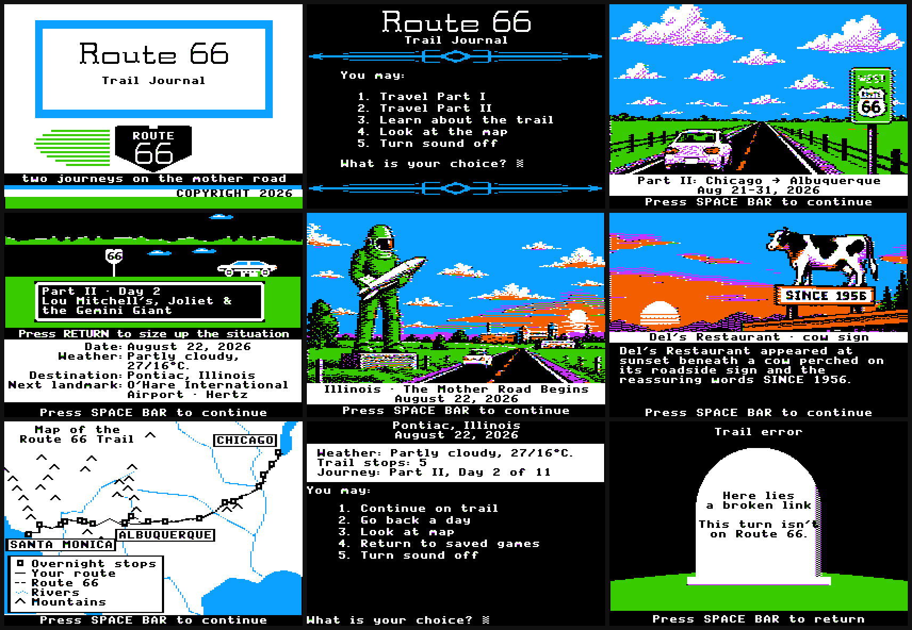

# Route 66 Trail Journal

**Play it: [route66-diary.vercel.app](https://route66-diary.vercel.app)**

[](https://route66-diary.vercel.app)

A road-trip diary that is convinced it is the 1985 Apple II version of *The Oregon Trail*.

We drove Route 66 twice in 2026 and wrote down what happened. A reasonable person would have made a blog. This is a blog in the same way that a Hyundai Elantra is a covered wagon.

|               | Part I                     | Part II                 |
| ------------- | -------------------------- | ----------------------- |
| Trail         | Santa Monica → Albuquerque | Chicago → Albuquerque   |
| Dates         | Feb 12–21, 2026            | Aug 21–31, 2026         |
| Wagon         | White Kia Sportage         | Cream Hyundai Elantra   |
| Days saved    | 10                         | 11                      |
| Oxen          | 0                          | 0                       |
| Rivers forded | 0                          | 0 (we used the bridges) |

Day 1 of the legendary road trip, in the diary's own words, "began with the bold, authentic road-warrior move of… flying from SJC to LAX." It does get more Route 66 after that. There are [donkeys](https://route66-diary.vercel.app/oatman-donkey-parade-road-to-kingman/#landmark).

## How to play

Click or tap a choice to pick it. On a screen without choices, click or tap anywhere to continue. Scrolling does nothing, on purpose: it is one screen at a time, like the game.

If you have a keyboard:

| Key          | What it does                                      |
| ------------ | ------------------------------------------------- |
| `SPACE`, `→` | Continue                                          |
| `←`          | Go back a screen                                  |
| `1`–`9`, `0` | Pick a choice (`0` is Day 10, as nature intended) |
| `RETURN`     | Size up the situation                             |
| `B`, `ESC`   | Back to the menu                                  |

Every screen has its own URL, so the browser's Back button works and you can send someone straight to [a cow on a sign](https://route66-diary.vercel.app/pie-painted-lines-neon-camels/#stop-9-1). Take a wrong turn and [you get a tombstone](https://route66-diary.vercel.app/dysentery/).

## What is going on in there

- Every screen is a 280×192 canvas, the Apple II's hi-res resolution, scaled up with hard pixels.
- There are no colors in the code that draws the screens. The framebuffer stores bits, and the six colors (black, white, green, violet, orange, blue) fall out of the bit pattern the way they did on a real color monitor. See `src/apple2/hires.js`.
- The font was measured from captures of the original game. `design-qa.md` has the measurements, for anyone who wants to know how wide a lowercase `m` is. (Seven pixels.)
- Pictures are converted to hi-res in your browser when they load, and they paint in bands, the way a picture loaded from a floppy disk did.
- The sound is a square wave, because the Apple II speaker could only click.
- Screen readers get the whole diary as ordinary text in reading order.
- Dependencies: React and Vite. That is the whole list.

## Run it

```sh
npm install
npm run dev      # local server
npm run build    # production build in dist/
```

## Where things live

| Path                  | What it is                                                           |
| --------------------- | -------------------------------------------------------------------- |
| `src/data.js`         | The diary: every day, paragraph, and trail stop                      |
| `src/storyPlan.js`    | Which picture or map goes with which paragraph                       |
| `src/journey.jsx`     | Turns the diary into lists of screens                                |
| `src/apple2/`         | The pretend Apple II: framebuffer, font, sprites, map, dither, sound |
| `src/components/`     | The monitor (one screen at a time) and the canvas                    |
| `public/assets/`      | The pictures                                                         |
| `scripts/apple2-art/` | How the pictures were made                                           |
| `AGENTS.md`           | The design rules, written for AI coding agents and curious humans    |

## The pictures

The 119 pictures were generated with the Codex CLI's image tool, drawn in the six hi-res colors so they survive the trip to 280 pixels wide. The prompts are in `scripts/apple2-art/prompts.mjs`. Regenerating them needs the Codex CLI, macOS `sips`, and `cwebp`. The original full-color illustrations they were restyled from are in `public/assets/part1` and `public/assets/part2`.

## Deploying

Vercel builds every push. `main` is production. `vercel.json` sends every path to the app and redirects the old `/blog/...` links.

## Fine print

This is a fan homage and has nothing to do with MECC or the current owners of *The Oregon Trail*. The diary and the pictures are ours. No oxen were harmed, because no oxen were rented.
